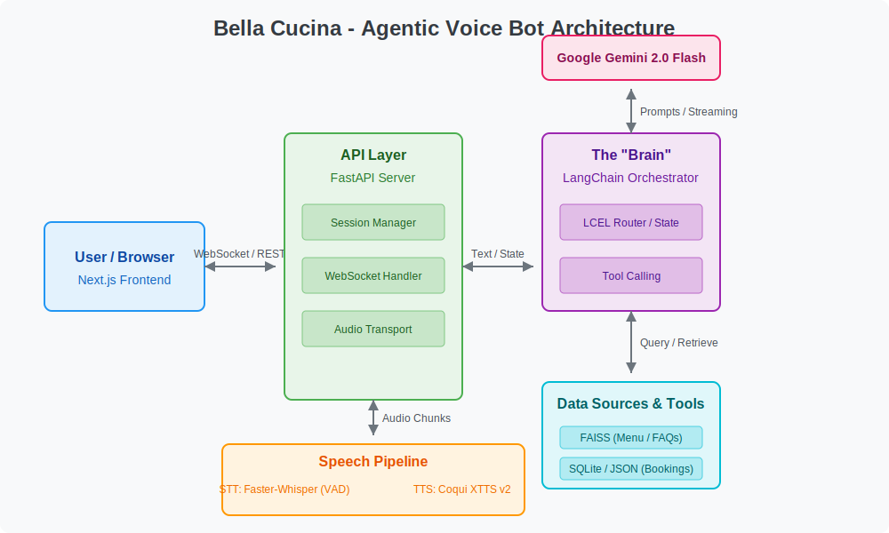

# AI Restaurant Reservation Assistant - "Bella Cucina"

This project is a voice-driven AI assistant that handles restaurant reservations, answers menu questions, and manages bookings through natural conversation.

## Architecture & Technology Stack

The system is designed with an advanced streaming architecture focusing on modularity and low-latency interaction. It acts as a highly responsive, interruptible agent using LangChain as an orchestrator (the "Streaming Brain") for a fluid conversational experience.



### Key Technologies & Why We Use Them

- **FastAPI**: Provides a high-performance REST API for session management and native WebSocket support for real-time audio streaming.
- **LangChain & LCEL**: Powers the "Brain" of the bot. LangChain Expression Language (LCEL) allows us to build declarative, modular routing chains to classify user intents and seamlessly call external tools.
- **Google Gemini 2.0 Flash**: Acts as the core LLM. Chosen for its extreme speed, advanced reasoning capabilities, and excellent function-calling reliability.
- **Faster-Whisper (STT)**: A highly optimized transcription model running locally on CPU/INT8. Combined with Voice Activity Detection (VAD), it ensures low-latency speech recognition.
- **Coqui XTTS v2 (TTS)**: An open-source text-to-speech engine capable of high-quality streaming synthesis, allowing the bot to start speaking before the full sentence is generated.
- **FAISS & SQLite**: FAISS is used for fast local vector retrieval (RAG) of menu items and FAQs, while SQLite manages structured reservation data.
- **Next.js & React**: Powers the frontend interface, offering a robust and responsive web client for users to initiate voice calls.

## Project Setup

### 1. Prerequisites
- Python 3.11+
- An environment management tool like `venv` or `conda`.
- Node.js and `npm` (for the frontend, if you choose to build it).

### 2. Backend Setup

Navigate to the project root directory (`voice-bot-mvp`).

**a. Create a Virtual Environment:**
```bash
python -m venv venv
```

**b. Activate the Environment:**
- On Windows:
  ```bash
  .\venv\Scripts\activate
  ```
- On macOS/Linux:
  ```bash
  source venv/bin/activate
  ```

**c. Install Dependencies:**
All required Python packages are listed in `backend/requirements.txt`. Install them using pip:
```bash
pip install -r backend/requirements.txt
```

### 3. Frontend Setup

This project includes a basic React frontend to interact with the voice bot.

- **Navigate to the frontend directory:**
  ```bash
  cd frontend
  ```

- **Install Dependencies:**
  Install the required Node.js packages using `npm`.
  ```bash
  npm install
  ```

### 4. Running the Application

**a. Backend**
First, ensure your backend server is running.

- **Navigate to the backend directory:**
  ```bash
  cd backend
  ```
- **Run the FastAPI server:**
  ```bash
  uvicorn main:app --host 0.0.0.0 --port 8000 --reload
  ```
The server will be accessible at `http://localhost:8000`.

**b. Frontend**
With the backend running, open a *new* terminal for the frontend.

- **Navigate to the frontend directory:**
  ```bash
  cd frontend
  ```
- **Start the NextJs development server:**
  ```bash
  npm run dev
  ```
This will open the application in your web browser, usually at `http://localhost:3000`. You can then use the UI to start a voice call with the 

---
*This project is being built by an AI agent. The setup instructions will be updated as the project progresses.*
